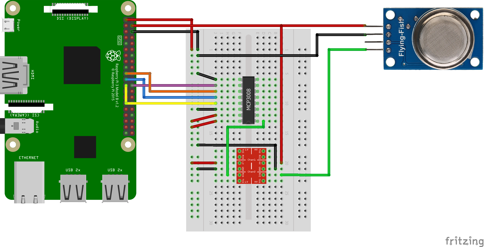

<h1>Autobrew</h1>

<h3>Automated beer brewing system for Rasberry Pi</h3>

 

<h4>Features</h4>

- Temperature control to optimize your brew performance
- Alcohol level estimation
- Pi hosted website to monitor your brew as it progresses
  - Temperature and alcohol level graphs
- Custom logos 

<h4>Hardware required:</h4>

Tech
- Raspberry Pi (2 or 3)
- ds18b20 temperature probe(s) [amazon](https://www.amazon.co.uk/gp/product/B00CHEZ250)
- MQ-3 alcohol sensor [aliexpress](https://www.aliexpress.com/item/32471915970.html)
- MCP3008 analog to digital converter [aliexpress](https://www.aliexpress.com/item/33040232084.html)
- USB heat pads [amazon](https://www.amazon.co.uk/gp/product/B07YX39TMQ)
- Beginner electronics kit (for breadboard, wires, etc) [amazon](https://www.amazon.co.uk/ELEGOO-Electronics-Potentiometer-tie-points-Breadboard/dp/B01LZRV539)

Brewing
- Brew kit (we love Coopers, but there are many others)
- 20L+ container
- Valve seal or cling film
- Bottles/other containers
- Funnel
- Small hose for syphoning (unless your container has a tap)
- Bubble wrap for insulation (optional)

<h4>Temperature probe connection wiring</h4>

Temperature probe connection tutorial
https://www.circuitbasics.com/raspberry-pi-ds18b20-temperature-sensor-tutorial/

<h4>Smell-o-scope wiring (MQ-3 alcohol sensor)</h4>

1. Enable SPI
run command "sudo raspi-config"
select interfacing options
select SPI

2. Check to see if SPI is activated
"lsmod" -> should see something like spi_2835

<h4>How to Enable USB power on/off for Heat Control</h4>
<h6>Steps</h6>

Install [libusb](https://libusb.info/) to your Raspberry pi
Commands:
- sudo apt-get install libusb-1.0-0-dev

Install [uhubctl](https://github.com/mvp/uhubctl#linux-usb-permissions) to your Raspberry pi
Commands:
- git clone https://github.com/mvp/uhubctl.git
- cd uhubctl
- make
- sudo cp uhubctl /usr/bin/uhubctl

Permission uhubctl to run without need for sudo
- run command
  - sudo uhubctl
- Note the **vid** in the lines like this "Current status for hub 1-1 [**2109**:3431 USB2.0 Hub, USB 2.10, 4 ports]"
- create a permission file with this command
  - sudo vi /etc/udev/rules.d/52-usb.rules
- write a line like this, replacing 2109 with your vid
  - SUBSYSTEM=="usb", ATTR{idVendor}=="2109", MODE="0666"
- type :wq and press enter to save :)
- run command to apply perm or restart the pi
  - sudo udevadm trigger --attr-match=subsystem=usb
- [Further documentation, if you need it](https://github.com/mvp/uhubctl#linux-usb-permissions)
